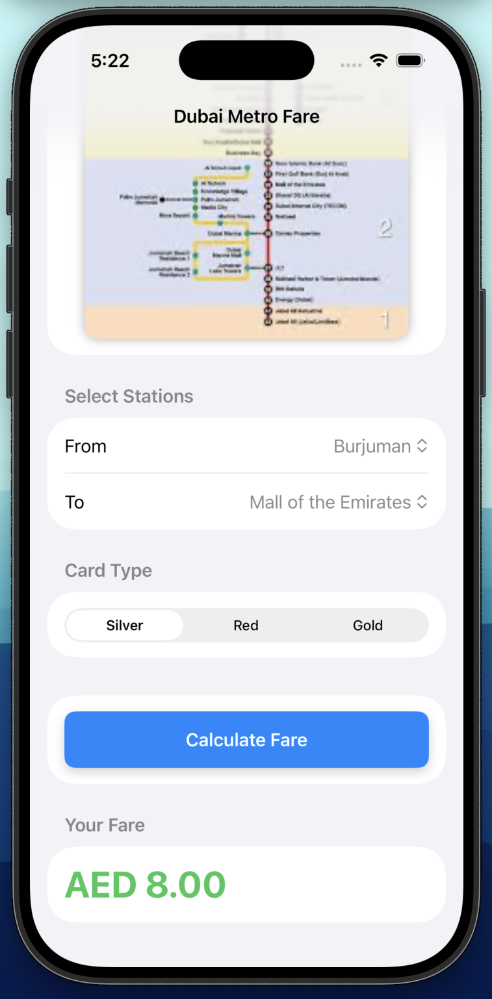

# Dubai Metro Fare Calculator

A full-stack application that calculates Dubai Metro fares based on selected stations and Nol card type.

This project consists of:
- SwiftUI iOS app (frontend)
- Spring Boot REST API (backend)

Built as a portfolio project to learn real-world app architecture and client-server communication.

---

## App Preview

---

## Features

- Select start and end metro stations
- Choose Nol card type (Silver, Gold, Red)
- Real-time fare calculation via backend API
- Clean and simple SwiftUI interface
- Fast response using HTTP requests
- Full client-server architecture

---

## How It Works

1. User selects stations and card type in the iOS app  
2. SwiftUI sends a request to the Spring Boot API  
3. Backend calculates fare based on zone difference  
4. Result is returned and displayed in the app  

---

## Technologies Used

### Frontend (iOS)
- Swift
- SwiftUI
- URLSession (API calls)

### Backend
- Java
- Spring Boot
- REST API

## How to Run

### Backend (Spring Boot)

- Navigate to `/backend`
- Run the application
- Server runs on:

### iOS App (SwiftUI)

- Open `/ios-app` in Xcode
- Update API URL to your local IP:
- Run on simulator or device

## Future Improvements

- Return structured JSON instead of plain text
- Add error handling (invalid stations, network issues)
- Improve UI and user experience
- Deploy backend online so the app works outside local network

